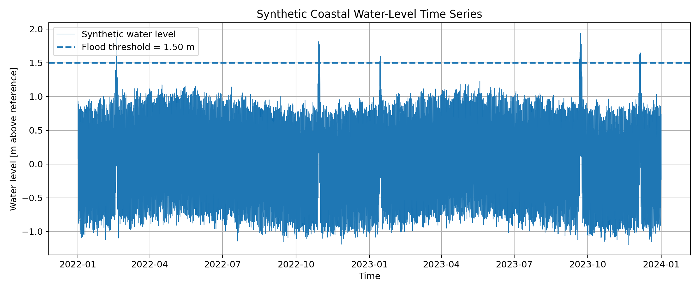
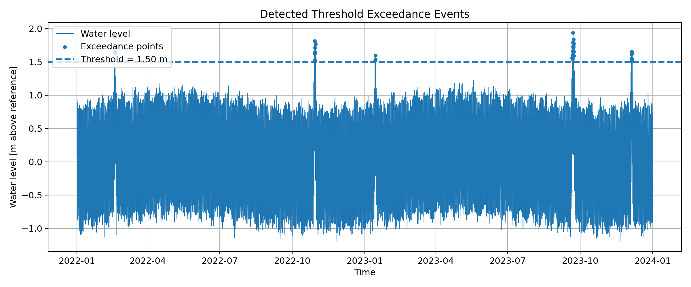
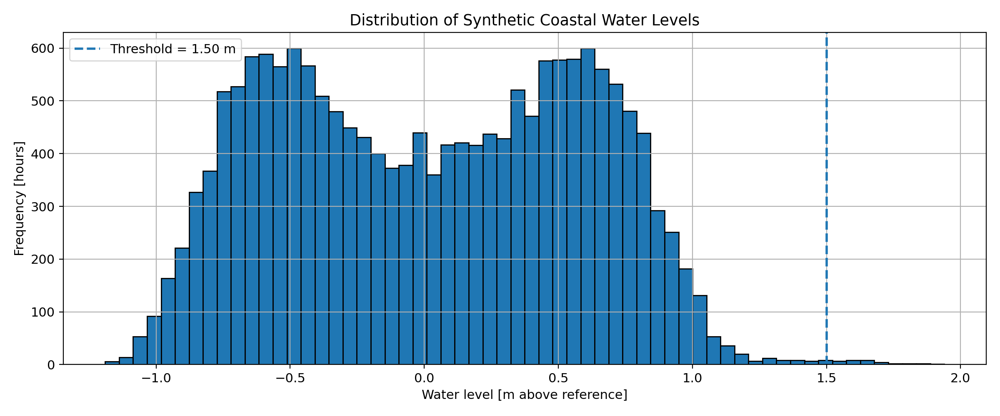
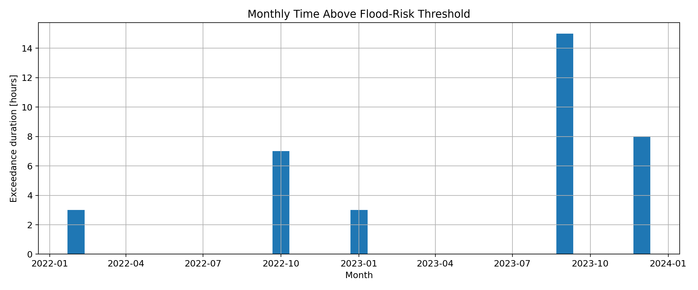
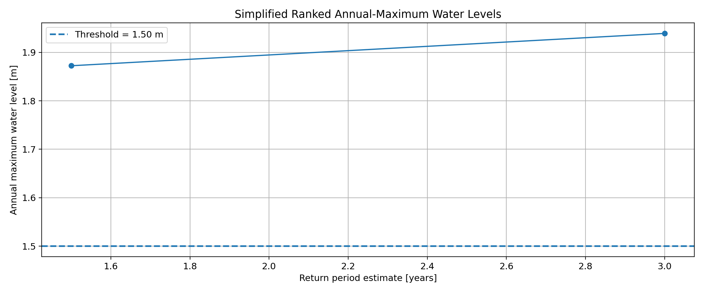
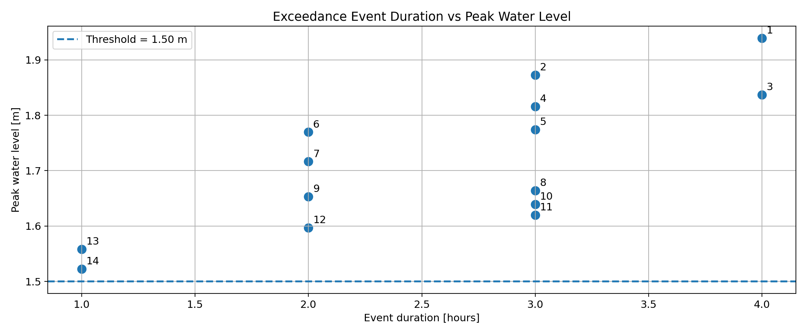

# Coastal Water-Level Risk Analysis in Python

## Project overview

This project demonstrates a compact engineering-style workflow for analysing coastal water-level time series and identifying potential flood-risk conditions.

The analysis uses a synthetic but realistic coastal water-level dataset containing:

- astronomical tide,
- seasonal water-level variation,
- random environmental/measurement noise,
- storm-surge events,
- a small long-term sea-level rise trend.

The dataset is synthetic and is not intended for real design decisions. However, the workflow is directly transferable to measured tide-gauge data or modelled coastal water-level outputs.

---

## Motivation

Coastal communities, ports, offshore assets, and low-lying infrastructure are exposed to high-water events driven by tides, storm surges, seasonal variability, and long-term sea-level rise.

A useful first step in coastal flood-risk screening is to analyse water-level time series and answer questions such as:

- How often does the water level exceed a defined flood-risk threshold?
- How long do exceedance events last?
- What are the highest water levels observed?
- Are exceedances concentrated in specific months or seasons?
- Which events are most severe in terms of peak level and duration?

This project answers those questions using a clear and reproducible Python workflow.

---

## Repository structure

```text
coastal-water-level-risk-analysis/
│
├── data/
│   ├── synthetic_water_level.csv
│   └── detected_exceedance_events.csv
│
├── figures/
│   ├── water_level_timeseries.png
│   ├── exceedance_events.png
│   ├── water_level_histogram.png
│   ├── monthly_exceedances.png
│   ├── return_period_curve.png
│   └── event_duration_vs_peak.png
│
├── notebooks/
│   └── 01_coastal_water_level_analysis.ipynb
│
├── src/
│   └── generate_synthetic_water_level.py
│
├── README.md
└── requirements.txt
```

---

## Methodology

The analysis follows a practical coastal-risk screening workflow:

1. Generate a synthetic hourly coastal water-level time series.
2. Inspect the dataset and check for missing values.
3. Define a simplified flood-risk threshold of **1.5 m above reference level**.
4. Detect all timestamps where water level exceeds the threshold.
5. Group consecutive exceedance timestamps into independent high-water events.
6. Calculate event-level statistics:
   - start and end time,
   - duration,
   - peak water level,
   - mean water level,
   - exceedance height above threshold.
7. Calculate monthly exceedance duration.
8. Produce a simplified ranked annual-maximum / return-period plot.
9. Save figures and event statistics for reporting.

---

## Example results

### Full water-level time series



### Detected exceedance events



### Water-level distribution



### Monthly exceedance duration



### Simplified ranked annual maxima



### Event duration versus peak water level



---

## Engineering interpretation

The analysis identifies periods where the synthetic coastal water level exceeds the selected flood-risk threshold. Instead of treating each hourly exceedance as a separate case, consecutive exceedance points are grouped into physically meaningful events.

This makes it possible to compare high-water events by both:

- **peak severity**, represented by maximum water level, and
- **exposure duration**, represented by time above threshold.

The monthly exceedance chart provides a simple indication of seasonal risk concentration, while the ranked annual-maximum plot gives a first screening-level view of extreme water levels.

For real coastal engineering applications, this workflow could be extended with measured tide-gauge data, site-specific flood thresholds, longer historical records, formal extreme-value analysis, wave setup, river discharge, and local topographic information.

---

## Technical stack

- Python
- pandas
- NumPy
- matplotlib
- pathlib
- Jupyter Notebook

---

## How to run

Clone the repository and install the required packages:

```bash
pip install -r requirements.txt
```

Generate the synthetic dataset:

```bash
python src/generate_synthetic_water_level.py
```

Then open and run the notebook:

```bash
jupyter notebook notebooks/01_coastal_water_level_analysis.ipynb
```

---

## Professional relevance

This project demonstrates skills relevant to water-sector and coastal-engineering roles:

- environmental time-series analysis,
- coastal flood-risk screening,
- threshold exceedance detection,
- event-based engineering statistics,
- clear technical visualisation,
- reproducible Python workflow,
- GitHub-ready project documentation.

It is especially relevant to roles involving coastal resilience, marine engineering, hydraulic/environmental modelling, metocean data, digital tools, and data-driven consulting.

---

## Limitations

This project is a simplified portfolio case. The dataset is synthetic and the return-period plot is only a ranked extreme-value screening plot, not a formal design-level extreme-value analysis.

A full professional coastal flood-risk assessment would require validated measured or modelled data, careful datum handling, longer records, local bathymetry/topography, hydraulic boundary conditions, and formal statistical treatment of extremes.
